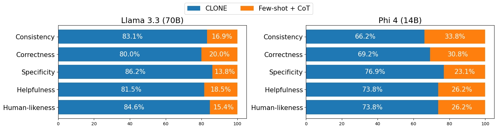

# CLONE: Synthetic Guideline-based Clinical Reasoning with Large Language Models for Early Diagnosis of Mild Cognitive Impairment

## Overview
<p align="center">
    
</p>

Early diagnosis of mild cognitive impairment (MCI) is essential to prevent its progression to Alzheimer’s disease. Human expert-driven 
diagnosis provides interpretable rationales but is time-consuming, while machine learning-based approaches offer efficiency but lack 
human-readable rationales. To address these limitations, we propose **CLONE** (**Cl**inical Reas**o**ning via **N**europsychologist **E**mulation), a 
three-stage framework leveraging large language models (LLMs) for MCI diagnosis: (1) emulating experts through role-playing, (2) 
synthesizing step-by-step diagnostic guidelines, and (3) performing clinical reasoning using the guideline. CLONE was evaluated on a 
real-world dataset of 65 subjects, achieving 89.23% diagnostic accuracy and outperforming the few-shot chain-of-thought (CoT) baseline 
by 6.15%, with specificity improving by 10.71%. Moreover, the synthesized guideline enhanced rationale quality, making rationales more 
consistent, correct, specific, helpful, and human-like compared to baselines. These findings highlight CLONE's potential to enable accurate 
diagnosis and reliable clinical reasoning, addressing key challenges in the field of MCI diagnosis.

## CLONE Framework
<p align="center">
    
</p>

The proposed framework, CLONE, is designed to emulate expert clinical reasoning, synthesize diagnostic guidelines, and apply them for accurate and interpretable diagnoses. CLONE comprises three stages: 

1. **Emulating experts** through role-playing
2. **Synthesizing** step-by-step diagnostic **guidelines**
3. **Clinical reasoning** using the synthesized guideline.

### RQ1: How does an LLM-driven synthetic guideline affect diagnostic accuracy through clinical reasoning? 
<p align="center">
    
</p>

### RQ2: How does an LLM-driven synthetic guideline impact on the quality of generated rationales?
<p align="center">
    
</p>

## Citation
```bibtex
```